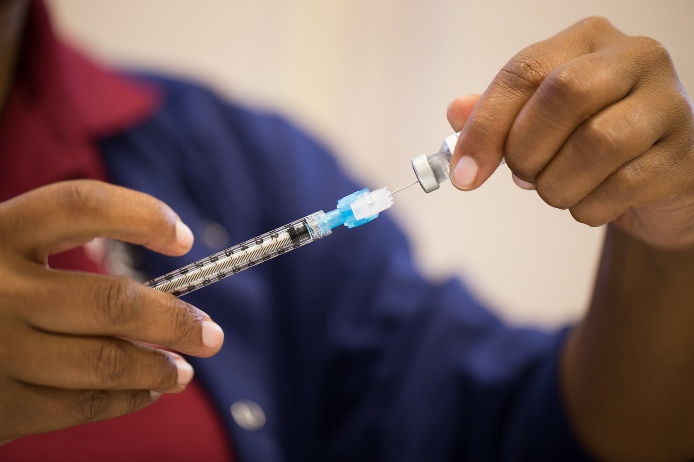

<h1>Overview</h1>

<strong>Can you predict whether people got H1N1 and seasonal flu vaccines using information they shared about their backgrounds, opinions, and health behaviors?</strong>

In this challenge, we will take a look at vaccination, a key public health measure used to fight infectious diseases. Vaccines provide immunization for individuals, and enough immunization in a community can further reduce the spread of diseases through "herd immunity."

As of the launch of this competition, vaccines for the COVID-19 virus are still under development and not yet available. The competition will instead revisit the public health response to a different recent major respiratory disease pandemic. Beginning in spring 2009, a pandemic caused by the H1N1 influenza virus, colloquially named "swine flu," swept across the world. Researchers estimate that in the first year, it was responsible for between <a href="https://www.cdc.gov/flu/pandemic-resources/2009-h1n1-pandemic.html">151,000 to 575,000 deaths globally</a>.

A vaccine for the H1N1 flu virus became publicly available in October 2009. In late 2009 and early 2010, the United States conducted the National 2009 H1N1 Flu Survey. This phone survey asked respondents whether they had received the H1N1 and seasonal flu vaccines, in conjunction with questions about themselves. These additional questions covered their social, economic, and demographic background, opinions on risks of illness and vaccine effectiveness, and behaviors towards mitigating transmission. A better understanding of how these characteristics are associated with personal vaccination patterns can provide guidance for future public health efforts.

<strong>This is a practice competition designed to be accessible to participants at all levels. That makes it a great place to dive into the world of data science competitions. Come on in from the waiting room and try your (hopefully steady) hand at predicting vaccinations.</strong>

Link : https://www.drivendata.org/competitions/66/flu-shot-learning/

Files:
- Flu_analysis-pandas.ipynb : first EDA using `pandas profiling`
- Flu_analysis-dtale_sweetwiz.ipynb : EDA using `dtale` and `SweetWiz`
- Flu_analysis-manual.ipynb : manual EDA partly reusing code from benchmark
- Flu_CatBoost-Feature_Selection.ipynb : feature selection using `mlxtend` library
- Flu_CatBoost-tuned-OptunaCVI.ipynb : prediction using `CatBoost` with `Optuna` for hyperparameters tuning

The file scored 0.8608. It can be greatly improved working on it (my current score, 16/02/21, is **0.8638 ranking 7th**). This is just a starting point showing some basic techniques. Spend some time analysing the dataset using EDA notebooks.

